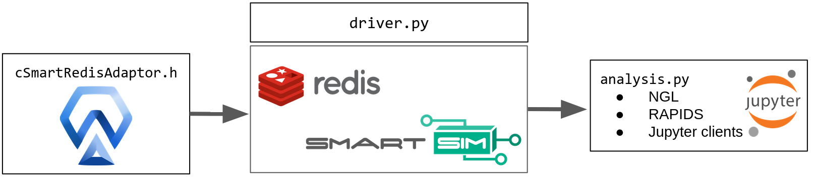

****************************************
In-situ infraestructure for Autodock-GPU
****************************************

Overview
========

Autodock-SS is an ongoing effort for in-situ processing (e.g. molecular visualization, dimensionality reduction) of MD simulations. In-situ capabilities allow analyzing data on the fly and save to disk only what is needed for further post-processing; thus, having the potential to reduce I/O bandwidth and storage needs.

Autodock-SS is built on top of Autodock-GPU and Cray's Smartsim. It provides communication and coordination mechanisms for data interchange between the different modules (implemented in C/C++ and python) of this project.

For a detailed description of Autodock-GPU and Cray's Smartsim refer to `Autodock-GPU repository <https://github.com/ccsb-scripps/AutoDock-GPU>`_ and `Smartsim documentation <https://www.craylabs.org/docs/overview.html>`_

The following diagram provides an overview of Autodock-SS modules. The general design follows a producer-consumer architecture, where the producer is a running simulation (Autodock-GPU) and consumers are analysis codes. Alternatively, Autodock-SS enables collaborative analysis of the running simulation via Project Jupyter. The core technology for data managing and sharing is based on the RedisAI database while SmartSim provides orchestration and communication services between simulation and analysis.  

Autodock-GPU has been extended with the ``cSmartRedisAdaptor`` class to support connecting, sending metadata, and docking steps to the RedisAI database.  ``analysis.py`` is a python script that connects to the RedisAI database to access simulation data for analysis and visualization. Finally, ``driver.py`` controls execution and orchestration.

Dependencies
------------

Autodock-SS is being tested with the following dependencies:

- Autodock-GPU 1.5.1
- SmartSim 0.3.2
- SmartRedis 0.2.0 (redis 3.5.3, redis-py-cluster 2.1.3)
- OpenBabel/OpenBabel-Python 3.1.1 
- NGLView 3.0.3

Compilation
-----------

To compile Autodock-SS we added a new flag ``USE_SMARTSIM`` to  Autodock-GPU's make command to enable the ``cSmartRedisAdaptor``:

.. code-block:: bash
    
    $make DEVICE=CUDA NUMWI=256 TARGETS=70 USE_SMARTSIM=ON

The script ``make.sh`` in ``autodock-v1.5.1`` directory provides additional details. 

It is possible to compile Autodock-SS on adaptor's debug mode by setting the ``DEBUG_SMARTSIM`` flag to ON:

.. code-block:: bash

    $make DEVICE=CUDA NUMWI=256 TARGETS=70 USE_SMARTSIM=ON DEBUG_SMARTSIM=ON

Debug mode allows to enable the ``cSmartRedisAdaptor`` to verify serialization of simulation data is correct but won't connect or send data to SmartRedis.

Data Sharing Strategy
=====================

TODO: Explains how Autodock-GPU handles data, the  ``cSmartRedisAdaptor`` and ``analysis.py``

Local Execution
===============

Instructions to execute Autodock-SS are condensed in ``driver.py`` script. First, we create an ``Experiment`` that executes Autodock-SS via ``launch_autodock.sh`` script. After docking is finalized, Autodock-SS' in-memory data base (SmartRedis) is left running to allow ``analysis.ipynb`` notebook get connected to SmartRedis for analysis/visualization. In summary:

- In a terminal, run Autodock-GPU simulation as shown below. 

.. code-block:: bash

    $ python driver.py

    14:41:27 fulano SmartSim[4063] INFO Working in previously created experiment
    === LAUNCH SUMMARY ===
    Experiment: autodock
    Experiment Path: /home/benjha/code/nvbl/scripts/autodock
    Launching with: local
    # of Ensembles: 0
    # of Models: 1
    Database: no

    === MODELS ===
    docking
    Model Parameters:
    {}
    Model Run Settings:
    Executable: /bin/bash
    Executable arguments: ['launch_autodock.sh']

    Dataset written
    <smartredis.smartredisPy.PyDataset object at 0x7fc7c412bfb0>

- In a different terminal, launch Jupyter and open ``analysis.ipynb`` notebook.

SUMMIT
======

TODO: Explains LSF scripts for the clients, modules and Jupyter 
